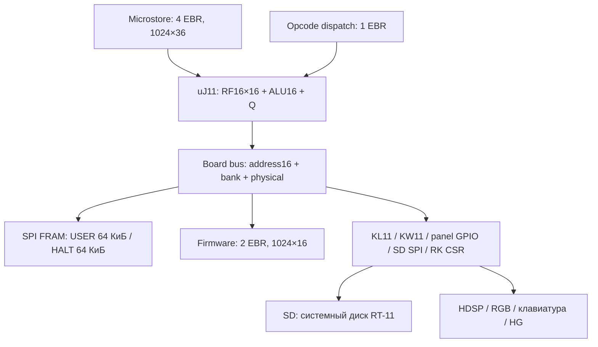

# Архитектура uJ11

Аппаратная часть соответствует установленной CP67b от 2026-09-13.
Программный FPP J‑11 обновлён до CP80 2026-09-19, ODT CP77 сохранён:
[установка](../history/README.md), [проверки конфигураций CP82](configuration.md),
[текущий комплект](software.md).
Пользовательские команды находятся в [руководстве](user-guide.md),
процедура сборки — в [руководстве по разработке](development.md).
Все PDP-11 адреса и opcode ниже **восьмеричные**, если явно не указано иначе.
Размеры и номера битов — десятичные; адреса микрокода с `0x` — hexadecimal.

## Состав и ресурсы

| Компонент | Реализация |
|---|---|
| FPGA | Lattice LCMXO2-1200HC-4SG32C |
| CPU | Специализированный микрокодный PDP-11/J-11 integer engine |
| Основная память | MR45V100A, 128 КиБ SPI FRAM, сохраняет содержимое без питания |
| Адрес CPU | 16 бит + выбор USER/HALT банка; без translation |
| Математика | Integer, EIS, микрокодный FIS и программный FPP J‑11 во FRAM; аппаратных MUL/DIV/barrel shifter нет |
| Системный диск | SD через подмножество RK611; на плате RT-11FB V05.03 |
| Консоль | KL11, UART 115200 8N1 |
| Таймер | KW11-L, номинально 50 Гц |
| Пульт | 16 символов HDSP, RGB, клавиатура 20 клавиш, программный драйвер |
| Обмен с хостом | HG.SYS в RT-11 + hgfsd на Linux, общие с пультом/JTAG pins |
| Отладчик | ODT в HALT FRAM, загружается через UJMOD, сам включается при cold boot |

Полный MAP/PAR/TRACE CP67b: **1244/1280 LUT, 381 FF, 7/7 EBR,
628/640 slices**, Fmax **32,032 МГц**. Свободны 36 LUT, 12 slices, 0 EBR.
В microstore занято 1005/1024 слов, свободны 19.
Это фактический полный компьютер; первоначальная цель ≤1100 LUT не достигнута.

CPU и FRAM SCK работают на номинальных **29,56 МГц** от OSCH.
Ограничение synthesis **31,824 МГц** проверяет принятый запас для OSCH/FRAM,
а не программирует такую частоту генератора. Fmax 32,032 МГц — результат
TRACE, не частота на плате. Допущения о внешних задержках и границы измерений:
[временные ограничения FRAM](memory-timing.md), [текущий отчёт](../releases/hc1200/result.json).

## Три вида исполняемого кода

| Код | Кто исполняет | Где находится | Как получается |
|---|---|---|---|
| Микрокод, слова 36 бит | Микросеквенсор CPU | Четыре EBR, 1024×36 | uJ11 microasm; из `microcode/uj11.uasm` |
| SD bootstrap, RK service, cold startup | Тот же uJ11 как обычные инструкции PDP-11 | Отдельная firmware memory, два EBR; resident/walker копируются в HALT FRAM | MACRO-11 исходники `firmware/boot/` |
| RT-11, UJMOD, ODT, SDBOOT, FPP | Тот же uJ11 | RT-11/UJMOD в USER FRAM; ODT/SDBOOT/FPP в HALT FRAM | DEC MACRO/LINK, файлы SAV/BIN на SD |

**SD/RK обслуживает PDP-11 firmware, а не микрокод CPU.** Отдельного
вспомогательного процессора нет. FIS, напротив, реализован именно микрокодом.
ODT, шрифт, дизассемблер, меню и автопрокрутка выполняются программно во FRAM.

## Datapath и микросеквенсор

RF содержит R0..R7 и T0..T7: два асинхронных чтения, одна синхронная запись
по адресу B. Он реализован distributed RAM, не EBR. PC существует только
как R7. Отдельно находятся Q16, IR16, MDR16 и PSW16. RF очищается reset-
микропрограммой через обычный write port.

Общая ALU выполняет арифметику, Boolean operations и сдвиг на один бит.
Byte flags выбирают знаковый разряд 7, word — 15; MOVB в регистр расширяет
знак, прочие byte-записи сохраняют старший байт по правилам инструкции.
Для вычитания C означает borrow. MUL/DIV/ASH/ASHC и FIS используют ALU,
Q и временные RF-регистры; счётчик циклов тоже находится в RF.

Синхронный microstore получает **следующий** uaddress. На одном разрешённом
фронте обновляются uPC и слово ROM; при ожидании памяти они удерживаются.
Microinstruction semi-horizontal, 36 бит, поля ALU/control перекрываются.
Формат кодирования — v12 с расширениями HALT/STEP. RTL и `uj11.uasm`
образуют единую версию; ROM и dispatch генерируются её штатной сборкой.

Есть NEXT, PAGE, JUMP, CJUMP, CALL/RETURN и dispatch. CALL хранит один адрес
возврата, не аппаратный стек. Вложенный CALL и пустой RETURN приводят к
диагностическому STOP. Выбор A/B поддерживает непосредственный номер RF,
динамические Rs/Rd и Rs|1/Rd|1.

| Dispatch | Биты, добавляемые OR к базовому uaddress |
|---|---|
| OR_MS | IR[11:9], source mode |
| OR_MD | IR[5:3], destination mode |
| OR_RR | Bit0: source mode=0; bit1: destination mode=0 |
| OR_BT | Bit0: byte instruction; bit1: нечётный адрес |
| OR_R67 | Bit0=0 для выбранного R6/R7, 1 для R0..R5 |

Все восемь addressing modes преимущественно микрокодные. Маленький D-input
STEP формирует +1/+2 с учётом byte и SP/PC. Специального большого EA engine нет.
MOV/ADD/CMP и другие R,R пути выполняют ALU/writeback/flags за одну execution
микрокоманду, но fetch и SPI wait clocks входят в реальную длительность команды.

В полном top выбран **ROM_DECODE=1**: отдельный синхронный dispatch ROM
экономит LUT; после захвата fetch есть внутренний такт PC/dispatch.
**Instruction prefetch в установленной сборке выключен.** Сохранение открытой
последовательной READ-транзакции FRAM не означает чтения следующей инструкции
заранее. Старые ideal-RAM «2 clocks/instruction» не являются скоростью CP67b.

## Банки FRAM и адреса

| Доступ | Что выбирается |
|---|---|
| USER, обычный адрес `000000..157777` | Нижняя FRAM, 56 КиБ RAM в обычной карте |
| HALT, обычный адрес `000000..157777` | Верхняя FRAM, с временными ROM overlays при cold boot |
| Обычный адрес `160000..177777` в любом банке | Общая I/O page, 8 КиБ |
| Явный physical lower/upper | Все 64 КиБ выбранного банка, включая память под I/O page; без CSR/ROM |
| RK DMA | Нижний физический банк, не HALT RAM |

Число «128 КиБ» относится к физическому чипу. RT-11 не получает линейное
128-КиБ пространство и не переключает банк через PSW mode bits.
USER/HALT здесь — служебные пространства uJ11 по мотивам ВМ2; это не полная
привилегированная архитектура DEC и не буквальная реализация всех особенностей ВМ2.
Alternate R0–R5, отдельные mode SP, PAR/PDR, separate I/D и 18/22-bit translation
в этой сборке не реализованы. Верхние PSW bits сохраняются как часть контекста,
но не включают эти механизмы. RT-11XM на CP67b не заявлена.

Карта HALT:

| Адреса | Содержимое |
|---|---|
| `000000..000177` | Векторы и общие слова ABI |
| `000100/000102` | CPC/CPSW, сохранённый USER-контекст |
| `000110/000112` | Вектор debug/STEP |
| `000120` | BOOTPC, выбранная точка USER bootstrap |
| `000122` | Программная метка CP67: `007000` |
| `000160` | Слово с адресом resident HALT→USER copier |
| `000170/000172` | Обычный HALT/загрузочный вход resident |
| `000200..000443` | Resident, проверки, copier и error path |
| `001000..001707` | Загружаемый 456-байтный helper UJMOD |
| `002000` | Wrapper ODT |
| `004000..004651` | Восстанавливаемая ROM-копия SD bootstrap, 426 байт |
| `005000..005777` | Код/данные cold walker, каждый reset восстанавливаются из ROM |
| `006000..006777` | Малый пул модулей, 512 байт; сейчас SDBOOT |
| `007000..007077` | Таблица: 8 записей по 8 байт |
| `007100..007777` | Системная область, запрещена для образов модулей |
| `010000..040465` | ODT CP77: immutable code/data, 12598 байт |
| `040466..042543` | ODT BSS/stack, 1070 байт; весь ODT — 13668 байт |
| `042544..057777` | Свободно между ODT и FPP, 6812 байт |
| `060000..070367` | FPP CP80: immutable code/descriptor, 4344 байта |
| `070370..071005` | FPP BSS/stack, 270 байт; весь FPP — 4614 байт |
| `071006..157777` | Свободно после FPP до I/O, 28154 байта |

Неперечисленные промежутки ниже `006000` принадлежат системной области,
а не свободному пулу. BSS не описана четырьмя полями таблицы: модули должны
согласовывать **всё** размещение данных, не только immutable image.
Точные правила инициализации — в [ABI модулей](modules.md).

## Загрузка

1. После конфигурации/длинного RESET CPU очищает RF и начинает в HALT-банке.
   ROM-overlay даёт начальные PC/PSW; исполнение не зависит от старого FRAM-кода.
2. ROM восстанавливает resident, необходимые векторы, HALT-копию SD bootstrap
   и cold walker. Копирование сопровождается readback.
3. Resident переносит встроенный bootstrap HALT→USER по `004000`.
4. Walker исполняется из HALT `005000`, записью по `000076` снимает HALT ROM
   overlay и устанавливает BOOTPC=`004000`. Благодаря этому ODT по `010000`
   больше не закрыт ROM.
5. До вызова любого retained-модуля идёт окно UART ESC, около 2,18 с номинально.
   ESC выбирает встроенный путь, пропуская всю таблицу.
6. В обычном старте записи обходятся по порядку 0..7: проверка STATUS,
   диапазона и суммы, затем `JSR PC` на BASE. Модуль возвращается через `RTS PC`.
7. ODT восстанавливает данные/векторы и включает debug последним. SDBOOT
   переносит собственную копию bootstrap в USER и выбирает BOOTPC.
   Включённый FPP очищает mutable state, устанавливает FP-вектор и публикует ready.
8. Resident делает START в USER с выбранным PC и PSW=0. Bootstrap
   инициализирует SD, читает LBA0/LBA1 и передаёт управление дисковой загрузке RT-11.

Резервная копия уже подготовлена до запуска модулей. Пустая таблица,
отключённый SDBOOT или ESC позволяют загрузиться встроенным bootstrap.
Снятие HALT overlay по `000076` и прежний SD boot_complete handshake
(SD control bit2 и USER read0) — разные события.

## Память и периферия

Core передаёт address16, request, write, byte, write_data16; ответ — ack,
read_data16, error. Адрес и данные удерживаются до принятия beat.
Слово по нечётному адресу даёт address fault до внешнего запроса.
Board переводит byte write в нужную lane и даёт один request-low такт
между обменами с периферией. Неотвечающий адрес заканчивается bus error,
а не произвольным чтением FRAM.

FRAM: SPI mode 0, READ=`03`, WREN=`06`, WRITE=`02`, little-endian слова.
24-битное поле SPI-адреса принадлежит протоколу чипа и содержит выбор банка;
оно не расширяет логический адрес CPU. ODDRXE выводит FRAM SCK с частотой CPU.
Последовательный READ нижнего банка сохраняет CS при следующем подходящем
запросе; redirect, запись, смена пространства или I/O закрывают этот путь.

| Адрес | Устройство/функция | IRQ |
|---|---|---|
| `166000/166001` | Panel CSR: строки клавиатуры / управляющий байт | Нет, polling |
| `177440..177476` | Подмножество регистров RK611 | `000210`, priority 5 |
| `177502` | SD SPI control, bit0 CS_n, bit1 fast; board bit2 — boot release | Нет |
| `177500` | SD SPI data; запись передаёт байт, чтение тактирует FF и получает байт | Нет |
| `177546` | KW11-L, bit6 IE, bit7 DONE | `000100`, priority 6 |
| `177560/177562` | KL11 RX CSR / buffer | `000060`, priority 4 |
| `177564/177566` | KL11 TX CSR / buffer | `000064`, priority 4 |
| `177750` | MAINT, read-only `000031`, без объявления FPA/MMU | Нет |

Это не полный набор CSR J-11/RK611. Отсутствующие CSR не считаются RAM.
Номинальный SD SCK: slow `29,56 MHz/(2×68)` ≈217,35 кГц,
fast `29,56 MHz/(2×2)` =7,39 МГц; FRAM и SD имеют разные SPI-пины/контроллеры.

RT-11 обращается к диску штатным DM.SYS. RK-команда вызывает внутреннюю
PDP-11 service через private vector `160000`; она выполняет SD CMD17/CMD24
и программное копирование между SD и нижней FRAM. Этот assist разрешён также
при IPL7, чтобы работал bootstrap. Обычное завершение RK затем выдаёт
гостевой IRQ `210` согласно IE. Это не аппаратный DMA engine и не HALT-модуль
из таблицы. Во время private service debug откладывается до её выхода.
32 байта RK CSR/scratch находятся в служебной области firmware EBR;
запись разрешена только в этот диапазон. Остальной firmware image доступен
на чтение. Поэтому слово ROM в именах RTL не означает, что RK state
занимает отдельный внешний банк FRAM.
Есть обработка проверенных RECALIBRATE/CCLR/error recovery; полного механического
RK611 и всех его команд нет. [Подробности](../history/README.md).

## Пульт, RGB и HG

В FPGA — один управляющий байт и синхронизированные входы клавиатуры.
Чтение `166000` возвращает `{pins, rows, 0000}`; изменение выходов происходит
при записи старшего байта (`166001` или соответствующей lane слова).

| Бит управляющего байта | Сигнал |
|---:|---|
| 0 | DIN |
| 1 | CE |
| 2 | CLK |
| 3 | RS |
| 4 | BLANK |
| 5 | Latch внешнего регистра RGB/выбора колонок |
| 6 | HG data out на TDO |
| 7 | Разрешение HG output на TDO |

HDSP serial stream, шрифт, RGB-регистр, сканирование/дребезг клавиатуры и
автопрокрутка обслуживаются PDP-11 программой. Нового framebuffer, font EBR
или аппаратного scroll timer нет. ODT считает задержки по опросам, не занимает
KW11 гостя и зеркалирует команды пульта полными строками на UART.

HG.SYS и host `hgfsd` обмениваются блоками через общий GPIO-интерфейс.
JTAG, HG и клавиатура используют общие pins: для работы пульта нужны GPIO
и физическое освобождение pins от программатора. При занятом HG TDO ODT
работает через UART и не захватывает панель. После COPY следует `UNLOAD HG`
и остановка своего hgfsd. [Распиновка](../boards/hc1200/pins.lpf),
[матрица и фотографии](panel-keyboard.md).

## Ограничения текущей конфигурации

MMU-прототип сохранён в Git-истории. Текущая сборка не определяет
`UJ11_MMU`, не включает MMU-файлы и не резервирует EBR под них. Программный FPP CP80 загружен в HALT FRAM;
FIS исполняется микрокодом. FPP обслуживает PSW-операнды через сохранённый
USER CPSW. Обычные integer-обращения к `177776` и общий NXM→HALT assist
не добавлены; они отложены. HALT-службы не вызывают RT-11/disk API, поскольку
IRQ/RK assist внутри них отложены. UART и внешнее время при останове продолжаются.

После cold reset модули восстанавливают свой начальный режим, а не предыдущий
сеанс отладки: breakpoint records, редактирование, HEX/OCT и очереди очищаются.
Прерванную USER-программу после нового запуска RT-11 следует загрузить заново.
Ни сохранность FRAM, ни checksum не дают автоматического отката произвольных
побочных эффектов неисправного инициализатора.
