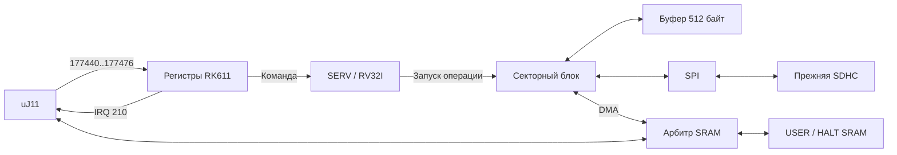

# HC7000: автономный RK611 / SERV

Это описание **MMU-less профиля** и его первоначального IOP на RV32I,
с аппаратными регистрами RK611. Установленная 7CBA/MMU использует
RV32IC и программные контроллеры в `firmware/storage`:
[SERV storage](serv-storage.md), [текущие ресурсы](synthesis.md#hc7000-установленная-7cba).

Только профиль `hc7000-lcd-sram`. CPU, микрокод, PDP-11 firmware и исходники
`boards/hc1200` не меняются; HC1200 по-прежнему выполняет `RKSERV.MAC` на
основном uJ11. В HC7000 старый RKSERV остаётся в общем ROM-образе, но его
вектор 160000 больше не выдаётся и ROM service overlay не включается.

## Устройство

- RTL `uj11_rk611.v`: регистры 177440..177476, GO/DONE, IE, IRQ 210/IPL5,
  байтовые записи и controller clear. Параметры команды защищены от изменения
  гостем до завершения; CCLR/SCLR имеют приоритет над ответом IOP.
- SERV: RV32I, W=1, без CSR, сжатых инструкций и MDU. Версия закреплена в
  `vendor/serv/UPSTREAM.json`; исходники и лицензия ISC сохранены без изменений.
- `firmware/iop/rk.c`: команды SD, CHS→LBA, ошибки и тайм-ауты. 1168 байт кода,
  2 КиБ общей памяти кода/стека. Линкер резервирует 512 байт под стек и
  запрещает BSS: controller reset не должен зависеть от старого содержимого RAM.
- `uj11_sector_engine.v`: один буфер 512 байт, аппаратные SPI-передачи и DMA.
  SERV не копирует сектор побайтово. READ проверяет CRC16 до записи в SRAM;
  WRITE дополняет неполный последний сектор нулями и передаёт CRC16.
- `uj11_sram_arbiter.v`: арбитраж на границах законченных слов с чередованием
  конкурирующих CPU/DMA запросов. SRAM сохраняет прежние setup/access/hold.
  Ответ одного мастера никогда не выдаётся другому.



Загрузка и SDBOOT используют прежний порт 177500/177502 и прежнюю SD-карту.
SD инициализирует PDP-11 bootstrap. Передача владения SPI происходит только
при CS=1, завершённом байтовом обмене и отсутствии запроса старого владельца.
Прямое обращение CPU к SD во время команды RK не обслуживается, пока IOP не
освободит карту; гостевой драйвер должен сериализовать эти два интерфейса.
Нельзя одновременно запускать прямые SD-команды и RK611 I/O из разных задач.

## Совместимость и границы

Поддержаны READ, WRITE, NOP, PACK ACK, RECALIBRATE; у RECALIBRATE выставляется
drive attention. Неподдерживаемая функция даёт ILF. Один накопитель, unit 0;
другие unit дают CS2.NED. Геометрия 22 сектора × 3 головки, до 815 цилиндров,
LBA без смещения, SDHC/блочная адресация, прежний DM.SYS без изменений.

DMA использует физические 16-битные адреса USER, включая область адресов,
которые для CPU являются I/O page; HALT банк не затрагивается. BA оборачивается
по 16 битам, как в прежнем firmware-контроллере. Ненулевые CS1.BA16/BA17 дают
CS2.NEM. MMU, BAI, дополнительные диски, механическое позиционирование и
полная диагностическая модель RK611 не реализованы.

CCLR, SCLR и peripheral reset отменяют текущую команду, сбрасывают SERV и
снимают SD CS. Уже начатый импульс SRAM WE заканчивается с прежним hold time;
отменённая команда не выдаёт позднего IRQ. Отмена физической записи SD не
является откатом уже принятых картой данных.

## Сборка

На Linux нужны `gcc-riscv64-unknown-elf` и `binutils-riscv64-unknown-elf`.
Флаги: RV32I/ILP32, `-Os`, freestanding, без libc. GCC выбирает multilib RV32I;
линкер разрешает libgcc только при необходимости. Образ и EBR создаёт
`tools/build_iop.py`. При повторной сборке кэш используется лишь при совпадении
SHA-256 всех входов и выходов. `--rebuild` принудительно пересобирает прошивку;
стабильные имена объектных файлов делают карту линкера воспроизводимой.

```sh
make hardware BOARD=hc7000-lcd-sram
make test-hc7000-disk
make test-sram test-hc7000-hg
make test-rt11 BOARD=hc7000-lcd-sram OUT=build/hc7000-serv-rt11
make synthesis BOARD=hc7000-lcd-sram OUT=build/hc7000-serv-build
make export BOARD=hc7000-lcd-sram OUT=build/hc7000-serv-build
```

Для macOS допускается скопировать `build/hc7000-iop` с Linux: отсутствие
компилятора принимается только с проверенным кэшем, который точно соответствует
текущим исходникам. HC1200 ни компилятора, ни этого кэша не требует.

EBR IOP явно используют `PDPW8KC` 512×18, с двумя 9-битными линиями и отдельными
byte-enable. Проверены все 512 слов и четыре байтовые линии RAM, все адреса
секторного буфера, а также весь дисковый сценарий с моделью EBR от Lattice:

```sh
python3 tools/test_hc7000_disk.py --memory \
  --vendor-library ~/.local/lscc/diamond/3.14/cae_library/simulation/verilog/machxo2 \
  --out build/iop-ram-vendor
python3 tools/test_hc7000_disk.py \
  --vendor-library ~/.local/lscc/diamond/3.14/cae_library/simulation/verilog/machxo2 \
  --out build/disk-vendor
```

Контроллер проверяется реальным кодом SERV: чтение/запись, частичные секторы,
переходы CHS, CRC, отсутствие карты/ответа/токена, отказ записи, busy timeout,
сброс при DMA, прерывания, владение SPI и конкуренция с CPU за SRAM. Полный
RT-11 тест дополнительно считает инструкции CPU во время RK busy и запрещает
возврат к старому вектору сервиса 160000.

## Ресурсы

Diamond 3.14, LCMXO2-7000HC-4TG144C, системная частота 24 МГц от внешних 12 МГц.

| Вариант | LUT4 | FF | EBR | Fmax |
|---|---:|---:|---:|---:|
| HC7000 с прежним RKSERV | 1303 | 412 | 7 | 25,688 МГц |
| HC7000 с SERV/DMA | 2184 | 832 | 11 | 26,585 МГц |
| HC1200, контрольная сборка | 1244 | 381 | 7 | 32,607 МГц |

Прирост HC7000: 881 LUT и 4 EBR. Включает весь контроллер, CRC, буфер, арбитр,
SERV, его регистровый файл и firmware, а не только ядро RISC-V. Занято около
32% LUT и 42% EBR HC7000. Внешние ограничения SRAM и hold проверяются TRACE.
Прежний JED и полный комплект SERV сохранены в локальном Git-архиве `31549d1` по исходным
путям `releases/hc7000/` и `releases/hc7000-serv/`.
[Историческая запись SERV](../history/releases/hc7000-serv/README.md) содержит
результаты; [восстановление](../history/releases/README.md) описано отдельно.
