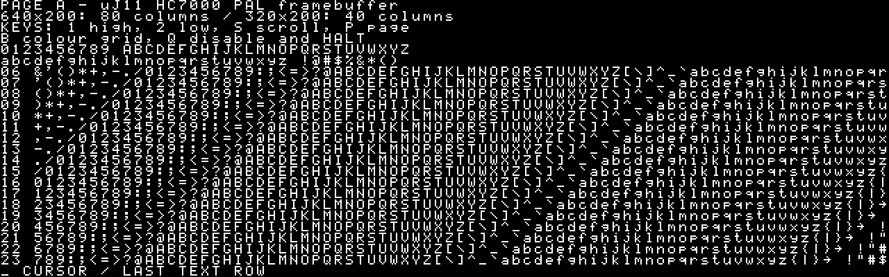

# HC7000 PAL preview — FA92

> Историческая запись: `releases/hc7000-pal-preview/README.md`, Git `31549d1`.
> Прошивки и полные снимки исходников удалены из рабочего дерева; [восстановление](../README.md).

Дата: 2026-09-30. Проверочная сборка framebuffer для LCMXO2-7000HC-4TG144C,
`hardware-lcd`, генератор 12 МГц, SRAM IS61WV102416BLL-10T.
**Не установлена на плату. Проверка композитного изображения ещё предстоит.**
Установленная ранее версия 7AE8 и содержимое SD этим комплектом не менялись.

hc7000-pal-fa92.jed (`releases/hc7000-pal-preview/hc7000-pal-fa92.jed`): checksum **FA92**,
SHA-256 `ca14cf2793c4fc34e7c95008344d1038677af3d0f479e036ec5291e215ccc694`.
Профиль: MMU, SERV storage, FPP off/FIS, diagnostics, PAL; CPU 50 МГц,
видео 64 МГц. Видео после reset выключено, CSR включения обрабатывает SERV.
Поддерживаются 640×200/16 цветов и 320×200/256 цветов, палитра RGB332,
кольцевая прокрутка и смена страниц на границе полного кадра.

## Синтез

Diamond 3.14, `pal-50-07`, полный MAP/PAR/TRACE и экспорт исходников,
совпавших с манифестом. [result.json](synthesis/result.json),
[jed.json](synthesis/jed.json), [TRACE](synthesis/pal-50-07_impl1.twr).

| Параметр | Результат |
|---|---:|
| LUT4 | **4862/6864**, свободно **2002** |
| SLICE | 2440/3432 |
| FF, включая I/O | 1754/7209 |
| EBR | **26/26** |
| PLL | **2/2** |
| Fmax CPU / требование | **50,666 / 50 МГц** |
| Fmax видео / требование | **65,552 / 64 МГц** |
| Отрицательный slack | 0 |

Прирост к установленной 7AE8: 883 LUT4, один EBR и один PLL.
Свободных EBR/PLL не осталось. Внешние SRAM constraints оценены;
четыре группы удерживаемых CDC-данных имеют проверенные ограничения 20/25 нс.
Fmax — расчёт Diamond; аппаратные измерения пока не проводились.

Для контроля [отдельно синтезирован VIDEO=0](validation/video-off-synthesis.json):
4006 LUT4, 25 EBR, Fmax 50,844 МГц. Отличие на 27 LUT от прежнего размещения
3979 LUT связано с новым результатом синтеза/размещения общей иерархии;
видеотракт в этой конфигурации исключён.
[Бинарник SERV без видео совпал побайтово](validation/video-off-firmware.json),
[HC1200 verify прошёл](validation/hc1200-verify.json).

SERV PAL: 10651 байт кода/констант, 976 байт BSS, стек 640 байт, зазор 20 байт.
Контроллеры RK05/RH/RL/XP/RQ сохранены; нового статического состояния в прошивке
для видео нет. PAL-профиль добавляет `-fno-tree-dominator-opts` к GCC 13.2.
Памяти под VT-парсер пока не освобождено.

## Проверки

| Проверка | Результат |
|---|---|
| [PAL RTL](validation/test-pal/simulation.log) | 13 кадров, 11507200 пикселей; максимальная загрузка строки 39,98 мкс при CPU+disk+video |
| [Цветовой кодировщик](validation/test-pal/tb_pal_encoder.log) | 33834 отсчёта, все RGB332 и обе фазы V, ошибка ≤1,846 кода DAC |
| [Официальная модель DP8KC](validation/vendor-ram.log) | все 1024 адреса, byte enable, задержка и gating |
| [CSR через настоящий SERV](validation/test-pal-bus/simulation.log) | 15 проверок, стек 208/640 |
| [PDP-11 демо](validation/test-pal-demo/simulation.log) | 393216 байт SRAM совпали с эталоном обоих режимов/страниц/прокрутки; выход в HALT |
| [RK05/RQ](validation/test-pal-rk-rq/controllers.log) | 915310 проверок, стек 320/640 |
| [RL/XP](validation/test-pal-rl-xp/controllers.log) | 367240 проверок, стек 336/640 |
| [RH](validation/test-pal-rh/primary.log) | основная/резервная/невалидная/неподдерживаемая метка; стек до 320/640 |
| [Влияние PAL на CPU](validation/test-pal-cpu-perf/result.json) | без изображения: 0%; с изображением: потеря 24,86–27,62% инструкций/с в коротких циклах, 7,30% в EIS |

Измерение CPU охватывает четыре полных кадра на каждый цикл; используются
настоящие MMU CPU, SRAM-контроллер, арбитры и видеотракт. Оба разрешения дают
одинаковые результаты. Эквивалентный рост времени выполнения коротких циклов —
33,08–38,16%, EIS — 7,87%. Дискового трафика и ОС в этом стенде нет;
это не измерение BSD на плате. [Методика и таблица](../../../docs/hc7000-pal.md#измерение-влияния-видео-на-cpu).

Дисковые регрессии исполняли тот же PAL-бинарник SERV; видеотракт в этих
стендах отключён. Они проводились до последней правки цветов встроенной
таблицы. Изменение не затрагивает прошивку дисков. Финальные PAL/CSR/PDP-11
тесты выполнены с RTL FA92. Общая нагрузка SRAM отдельно проверена в PAL RTL
непрерывными запросами CPU и дискового DMA, а также длительным CPU LOCK.
Разница карты линковки SERV между прогонами — временные имена GCC LTO;
код, данные и EBR-инициализация совпадают.

В `sources/` сохранены входы синтеза, включая сгенерированные ROM, LPF и
build manifest. `validation/` содержит исходные журналы и JSON с хешами;
контрольные суммы файлов комплекта — в `SHA256SUMS`.

## Демо и следующий шаг

В demo/ (`releases/hc7000-pal-preview/demo`) находятся исходник MACRO-11, бинарник и описание сборки.
3798 байт, загрузка и старт с восьмеричного **020000**. Запускать самостоятельно
из ODT после штатной остановки ОС: программа заменяет настройку MMU и использует
SRAM `0x1E0000–0x1FFFFF`, которая пока не зарезервирована у ОС.
Клавиши UART: `1` — 80×25, `2` — 40×25, `S` — прокрутка, `P` — страница,
`B` — цвета/чёткость, `Q` — отключить видео/MMU и HALT.

Остаётся проверить PAL RCA на телевизоре/видеозахвате: синхронизацию, уровни
на 75 Ом, цвет, overscan, читаемость 80 столбцов и длительную дисковую нагрузку.
Полные загрузки BSD/RT-11/RSX с активным видео ещё не проверены.
Экранная терминальная линия, клавиатура, VT и резервирование памяти для ОС —
следующий этап. [Регистры, архитектура и команды сборки](../../../docs/hc7000-pal.md).
